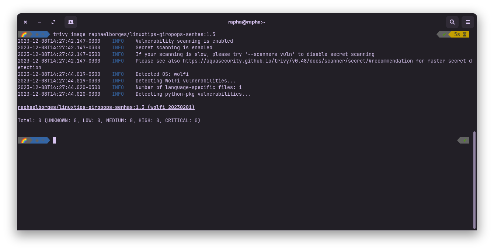
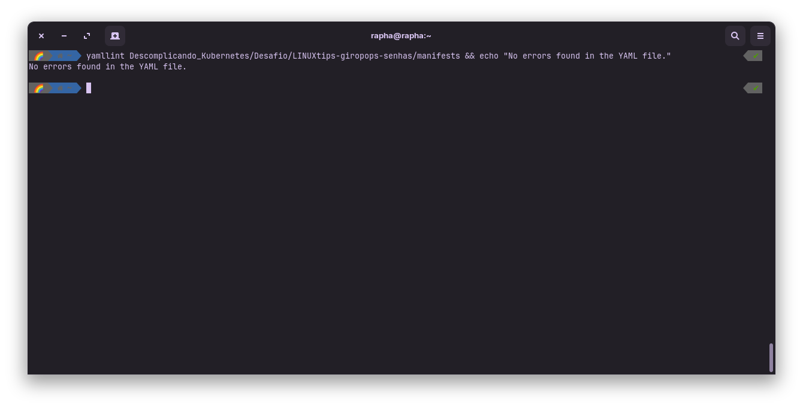

# Projeto Prático - Programa Intensivo em Containers e Kubernetes
### Desenvolvimento e Otimização Segura de Aplicações Kubernetes

## Objetivo

O objetivo deste projeto é criar e implementar uma aplicação em Kubernetes, utilizando as melhores práticas de segurança e otimização.

Este projeto utiliza como base a aplicação [Giropops-Senhas](https://github.com/badtuxx/giropops-senhas).

## Requisitos

- [Docker](https://docs.docker.com/get-docker/)
- [Kubectl](https://kubernetes.io/docs/tasks/tools/)
- [Helm](https://helm.sh/docs/intro/install/)
- [kube-prometheus](https://prometheus-operator.dev/docs/prologue/quick-start/)
- [Cosign](https://github.com/sigstore/cosign)
- [Trivy](https://aquasecurity.github.io/trivy/v0.47/getting-started/installation/)
- [Zora Dashboard](https://zora-dashboard.undistro.io/)
- [Ingress NGINX Controller](https://kubernetes.github.io/ingress-nginx/deploy/)
- [Cert-Manager](https://cert-manager.io/docs/installation/kubernetes/)
- [Kind](https://kind.sigs.k8s.io/docs/user/quick-start/)
- [Locust](https://locust.io/)
- [yamlint](https://yamllint.readthedocs.io/en/stable/index.html)
- [Digestabot](https://github.com/chainguard-dev/digestabot)

## Imagem Docker

A imagem foi construída utilizando como base as imagens [Python da Chainguard](https://edu.chainguard.dev/chainguard/chainguard-images/reference/python/), que já possuem as melhores práticas de segurança implementadas. Utilizando a técnica de [multi-stage build](https://docs.docker.com/develop/develop-images/multistage-build/) para reduzir o tamanho da imagem final e garantir que a imagem final não possua nenhuma vulnerabilidade.

Você pode buildar a imagem utilizando os arquivos na pasta 'giropops-senhas'. Dentro dessa estão os arquivos Dockerfile, o requirements.txt e todos os arquivos necessários para a aplicação funcionar.

```bash
cd giropops-senhas
docker build -t raphaelborges/linuxtips-giropops-senhas:1.3 .
```

Porém toda alteração no código fonte da aplicação irá gerar uma nova imagem, que será feito o build e enviada automaticamente para o Docker Hub através do GitHub Actions. A imagem atualizada pode ser encontrada no [Docker Hub](https://hub.docker.com/repository/docker/raphaelborges/linuxtips-giropops-senhas/)

Para verificar se a imagem possui alguma vulnerabilidade, utilize o [Trivy](https://aquasecurity.github.io/trivy/v0.47/getting-started/installation/)

```bash
curl -sfL https://raw.githubusercontent.com/aquasecurity/trivy/main/contrib/install.sh | sh -s -- -b /usr/local/bin v0.47.0
trivy image raphaelborges/linuxtips-giropops-senhas:1.3
```




## Configuração do Cluster

### Criando o Cluster

1. Crie o cluster utilizando o [Kind](https://kind.sigs.k8s.io/docs/user/quick-start/)

```bash
kind create cluster --name pick --config manifests/kind/kind-ingress-cluster.yaml
```

2. Instalando o [Ingress NGINX Controller no Kind](https://kind.sigs.k8s.io/docs/user/ingress/#ingress-nginx)

```bash
kubectl apply -f https://raw.githubusercontent.com/kubernetes/ingress-nginx/main/deploy/static/provider/kind/deploy.yaml
```

Aguarde a instalação do Ingress NGINX Controller:

```bash
kubectl wait --namespace ingress-nginx \
  --for=condition=ready pod \
  --selector=app.kubernetes.io/component=controller \
  --timeout=90s
```

3. Instalando o Cert-Manager

```bash
kubectl apply -f https://github.com/cert-manager/cert-manager/releases/download/v1.13.2/cert-manager.yaml
```

4. Instale o yamllint e verifique se os manifestos estão corretos

```bash
sudo apt-get install yamllint
yamllint manifests/ && echo "No errors found in the YAML file."
```



4. Crie o Issuer de staging e o ClusterIssuer de produção

```bash
kubectl apply -f manifests/namespace.yaml
kubectl apply -f manifests/Issuers/staging_issuer.yaml
kubectl apply -f manifests/Issuers/production_issuer.yaml
```

5. Instale o [kube-prometheus](https://prometheus-operator.dev/docs/prologue/quick-start/)

```bash
git clone https://github.com/prometheus-operator/kube-prometheus.git
cd kube-prometheus
kubectl create -f manifests/setup
until kubectl get servicemonitors --all-namespaces ; do date; sleep 1; echo ""; done
kubectl create -f manifests/
cd ..
rm -rf kube-prometheus
```

6. Instale o [Cosign](https://github.com/sigstore/cosign)

```bash
curl -O -L "https://github.com/sigstore/cosign/releases/latest/download/cosign-linux-amd64"
sudo mv cosign-linux-amd64 /usr/local/bin/cosign
sudo chmod +x /usr/local/bin/cosign
```

7. Utilize a chave publica disponível no arquivo `key-pair/consign.pub` para verificar a imagem no Docker Hub

```bash
cosign verify --key key-pair/cosign.pub raphaelborges/linuxtips-giropops-senhas:1.3
```

8. Instale o Metrics Server

```bash
kubectl apply -f https://github.com/kubernetes-sigs/metrics-server/releases/latest/download/components.yaml
```

Como estamos utilizando o Kind, precisamos aplicar um patch para que o Metrics Server funcione corretamente. Faremos isso utilizando o kustomize.

```bash
curl -s "https://raw.githubusercontent.com/kubernetes-sigs/kustomize/master/hack/install_kustomize.sh"  | bash
sudo mv kustomize /usr/local/bin
kustomize build manifests/kind/ | kubectl apply -f -
```

9. Aplique os manifestos presentes na pasta `manifests`

```bash
kubectl apply -f manifests/
```

10. Instale o [Zora Dashboard](#implementando-o-zora-dashboard)

11. Para que nossos serviços funcionem localmente, precisamos adicionar algumas entradas no arquivo `/etc/hosts`

```bash
vim /etc/hosts
```

Adicione as seguintes linhas:

```bash
127.0.0.1   prometheus.giropops.local
127.0.0.1   grafana.giropops.local
127.0.0.1   alertmanager.giropops.local
127.0.0.1   giropops.com.local
```

12. Acesse cada um dos serviços através dos links abaixo:

- [Giropops](https://giropops.com.local)
- [Prometheus](https://prometheus.giropops.local)
- [Grafana](https://grafana.giropops.local)
- [Alertmanager](https://alertmanager.giropops.local)
- [Locust](https://locust.giropops.local)

13. Testando a aplicação e o HPA

Acesse o serviço do [Locust](https://locust.giropops.local) e execute o teste de carga. Após alguns minutos, o HPA irá aumentar o número de réplicas do serviço de Senhas. Como estamos utilizando o Kind e o nosso service type é ClusterIP, precisamos acessar o serviço através do IP do cluster. Para isso, execute o comando abaixo:

```bash
kubectl get svc -n giropops
```

Copie o IP do serviço `giropops-svc` e execute o teste no Locust utilizando este IP.

## Implementando o Zora Dashboard

1. Crie sua conta no site do [Zora](https://zora-dashboard.undistro.io/)

2. Instale o [Helm](https://helm.sh/docs/intro/install/)

3. Copie o comando de instalação do Zora Dashboard, já com o Workspace ID direto da aba 'Connect Cluster' do site do Zora Dashboard

```bash
helm repo add undistro https://charts.undistro.io --force-update
helm repo update undistro
helm upgrade --install zora undistro/zora \
  -n zora-system \
  --version 0.7.0 \
  --create-namespace \
  --wait \
  --set clusterName="$(kubectl config current-context)" \
  --set saas.workspaceID='ef1dd987-cf77-49b5-b2bb-f0419b1ecb4e'
```

4. Após a instalação você pode monitorar o seu cluster através do site do [Zora](https://zora-dashboard.undistro.io/)

TODO:

- [ ] Implementar Terraform para facilitar a utilização
- [ ] Adicionar mais detalhes do projeto no Readme
- [ ] Diretrizes para contribuições
- [ ] Revisar o upload do resultado do Trivy para a aba Security
- [ ] Assinatura e validação da Image com Cosign direto na Automação com GitHub Actions
- [ ] Testes de performance
- [ ] Trabalhar na parte de monitoramento
- [ ] Corrigir o erro 'line too long'
- [ ] Nova versão do Girpopops-Senhas via GitHub Actions